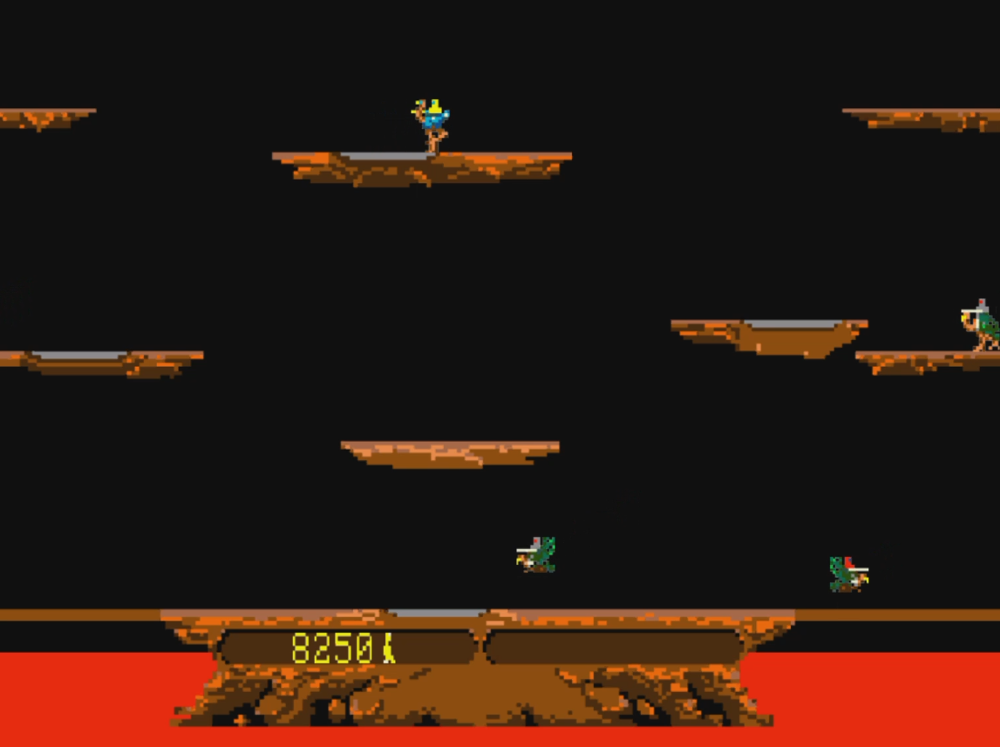

# Joust Remake

Created using a thin wrapper of OpenGL in C

## How to play
  - Clone the project
  - Extract the downloaded folder
  - Navigate inside the Game folder and lauch the .exe
  - Controls are left/right arrow keys to move, and spacebar to flap your wings.

# Featured Systems

## Object-Oriented Design
- Created objects in a hierarchical structure using vtables

## Collision System
- Created a system for which all entities can collide and respond appropriately with one another
- This includes players and enemies killing each other when necessary, bouncing off of platforms, and enemies bouncing off each other

## Enemy AI
- There are 3 enemies with varying AI for each
- Each enemy type has a different speed and sight radius
- All enemies will wandering the battlefield choosing random intervals to turn around and flap/fly until seeing the player
- Once they see a player they will attempt to Joust with them

This was a one month project that used advanced object-oriented design and programming techniques.
